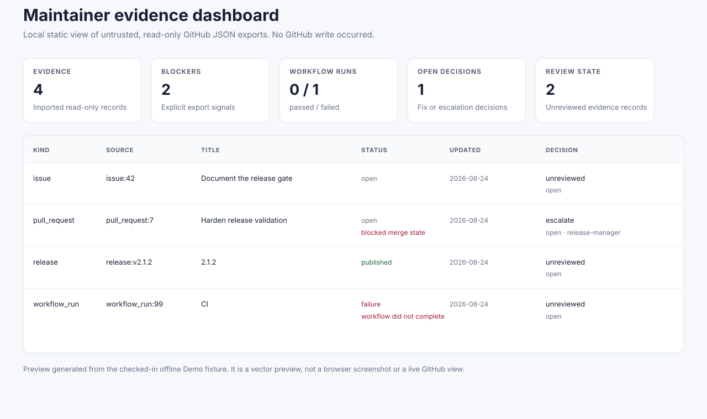

# Three-minute maintainer demo

This demo turns the checked-in, intentionally untrusted GitHub JSON fixture into
an evidence bundle, a local decision ledger, and an escaped static dashboard.
It runs entirely on your machine: it does **not** call GitHub, create an Issue,
label anything, merge code, or publish a release.

Prerequisite: Python 3.10 or newer. Run the commands from the repository root.
All outputs are confined to the ignored `.aipc/demo/` directory.

```bash
python tools/validate_skill.py skills/ai-project-copilot

python skills/ai-project-copilot/scripts/github_evidence_sync.py \
  --input-dir examples/github-export \
  --repo . \
  --output .aipc/demo/github-evidence.json \
  --format markdown

python skills/ai-project-copilot/scripts/run_state_ledger.py init \
  --repo . \
  --ledger .aipc/demo/maintainer-ledger.json

python skills/ai-project-copilot/scripts/run_state_ledger.py sync \
  --repo . \
  --ledger .aipc/demo/maintainer-ledger.json \
  --bundle .aipc/demo/github-evidence.json
```

The fixture yields four records and two blockers: a blocked pull request and a
failed CI run. It does not treat either as permission to act; record a local,
reviewable escalation instead:

```bash
python skills/ai-project-copilot/scripts/run_state_ledger.py decide \
  --repo . \
  --ledger .aipc/demo/maintainer-ledger.json \
  --evidence-id 638789e58bc5a2f97842 \
  --decision escalate \
  --status open \
  --owner release-manager \
  --actor demo-maintainer \
  --note "Resolve the blocked merge before considering a release."

python skills/ai-project-copilot/scripts/render_maintainer_dashboard.py \
  --repo . \
  --bundle .aipc/demo/github-evidence.json \
  --ledger .aipc/demo/maintainer-ledger.json \
  --output .aipc/demo/maintainer-dashboard.html

python skills/ai-project-copilot/scripts/run_state_ledger.py status \
  --repo . \
  --ledger .aipc/demo/maintainer-ledger.json \
  --format markdown
```

Expected result: `revision: 2`, four ledger entries, and one visible pending
escalation. Open `.aipc/demo/maintainer-dashboard.html` locally to inspect the
same escaped evidence and decision trail.



The preview is a deterministic vector rendering of this fixture's expected
result. It is not a live GitHub view or a browser screenshot; the commands
above remain the source of truth for a fresh local run.

## Safe recovery of a crash-left local lock

Normal ledger writes release their lock automatically. If a process crashed,
first inspect the local lock without changing it:

```bash
python skills/ai-project-copilot/scripts/run_state_ledger.py lock-status \
  --repo . \
  --ledger .aipc/demo/maintainer-ledger.json
```

Recovery is available only when the lock is on this host, its recorded process
is provably inactive, and it is older than the configured age. It requires an
explicit decision and moves the old lock into an ignored recovery directory
rather than deleting it:

```bash
python skills/ai-project-copilot/scripts/run_state_ledger.py recover-stale-lock \
  --repo . \
  --ledger .aipc/demo/maintainer-ledger.json \
  --min-stale-age-seconds 300 \
  --force-stale-lock
```

## Intentional failure path

Run the import command a second time with the same `--output`. It fails with an
overwrite refusal. That is deliberate: evidence and dashboard generation never
silently replace a previous artifact. Use a new output name or remove the local
demo directory yourself after reviewing it.

## Continue with a real repository

Replace `examples/github-export` with an authorized local export and `--repo .`
with the target checkout. Then use the Core workflow for focused repository
context, change risk, release readiness, and supply-chain evidence. Keep every
GitHub mutation, merge, release, deployment, permission change, and deletion
under explicit human authority.
