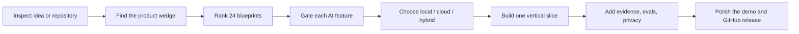

<p align="center">
  
</p>

<h1 align="center">AI Project Copilot</h1>

<p align="center">
  Turn a vague idea or an ordinary repository into a credible, demo-ready AI product.<br />
  One focused Agent Skill. Twenty-four showcase blueprints. No AI theater.
</p>

<p align="center">
  <a href="https://github.com/sun461941-hub/ai-project-copilot/actions/workflows/ci.yml"></a>
  
  
  
  <a href="LICENSE"></a>
</p>

<p align="center">
  <a href="README.zh-CN.md">简体中文</a> ·
  <a href="skills/ai-project-copilot/SKILL.md">Read the skill</a> ·
  <a href="skills/ai-project-copilot/references/showcase-projects.md">Browse all 24 projects</a> ·
  <a href="GITHUB_UPLOAD.zh-CN.md">GitHub upload guide</a>
</p>

> **This is not a bag of generic prompts.** It is a repeatable product-engineering workflow that makes an agent inspect the repository, find the strongest AI wedge, build one working vertical slice, add evaluation and trust boundaries, and package the result for a convincing GitHub demo.

## What it does

AI Project Copilot helps ChatGPT or Codex:

- discover the most valuable AI capability for a real user problem;
- select from **24 high-signal project blueprints** instead of cloning another generic chatbot;
- choose local-first, cloud, or hybrid architecture deliberately;
- implement RAG, tools/agents, multimodal input, voice, media generation, local models, memory, streaming, evals, and observability only when they earn their complexity;
- protect secrets, private traces, model licenses, user-imported weights, and consequential tool actions;
- produce a polished README, realistic sample path, one-minute demo script, tests, evals, and honest limitations.

## The core workflow



The feature gate asks six questions before anything is added:

| Gate | Question |
|---|---|
| Need | What user problem disappears? |
| Proof | What visible result demonstrates value? |
| Grounding | What source, data, or tool keeps it accurate? |
| Fallback | What happens when the model is wrong, slow, offline, or unavailable? |
| Boundary | What data leaves the device or repository? |
| Evaluation | What catches a regression? |

## Featured project blueprints

| Project | Why it stands out | Signature demo |
|---|---|---|
| **Codex Build Visualizer** | Privacy-safe agent/build trace visualization | Scrub through file edits, tools, approvals, CI failures, and recovery in one synchronized timeline |
| **Android Local Video Runtime** | Model-agnostic, user-imported, on-device video inference | Generate a short offline clip while showing memory, thermal, latency, and backend telemetry |
| **AI Codebase Cartographer** | Evidence-linked architecture and impact analysis | Ask what breaks after an interface change and watch affected modules/tests light up |
| **Test Failure Replay Studio** | Cross-platform CI debugging | Replay the exact divergence between Windows, macOS, and Linux runs |
| **Multimodal Research Canvas** | Papers, charts, images, notes, and citations in one workspace | Connect a claim to exact text passages and visual regions |
| **Agent Memory Inspector** | Makes AI memory visible and controllable | Inspect provenance, confidence, expiry, conflicts, and one-click forget controls |
| **Model Eval Arena** | Replaces model-selection vibes with evidence | Compare outputs, graders, latency, cost, and regressions live |
| **On-Device Multimodal Assistant** | Honest offline/private AI | Disconnect the network and complete a real image/text/audio task locally |
| **Browser Workflow Studio** | Human-controlled, editable automation | Turn one demonstrated task into a permissioned visual workflow |
| **Accessibility Copilot** | High-impact multimodal interaction | Transform a dense visual interface into a navigable, voice-controllable structure |

The complete catalog includes developer tools, on-device systems, research, automation, education, accessibility, data/evals, voice, and creative media: [`showcase-projects.md`](skills/ai-project-copilot/references/showcase-projects.md).

## Install

### Codex skill installer

In Codex, run:

```text
$skill-installer install https://github.com/sun461941-hub/ai-project-copilot/tree/main/skills/ai-project-copilot
```

Restart Codex only if the new skill does not appear automatically.

### Manual install

User-wide installation:

```bash
mkdir -p ~/.agents/skills
cp -R skills/ai-project-copilot ~/.agents/skills/ai-project-copilot
```

Repository-scoped installation:

```bash
mkdir -p .agents/skills
cp -R /path/to/ai-project-copilot/skills/ai-project-copilot .agents/skills/ai-project-copilot
```

The release ZIP produced by this repository contains a single top-level `ai-project-copilot/` folder and can be uploaded directly to clients or APIs that accept Agent Skill archives.

## Use

Explicit invocation:

```text
$ai-project-copilot Turn this repository into a compelling open-source AI project.
Preserve the current stack, choose one strong vertical slice, add tests and evals,
and prepare a 60-second demo plus an honest GitHub README.
```

Retrofit an existing project:

```text
Use $ai-project-copilot to audit this app and add the single highest-value AI capability.
Do not add a generic chatbot. Keep all existing non-AI behavior working.
```

Choose a project direction:

```text
Use $ai-project-copilot to propose and rank five GitHub-worthy AI projects that are
local-first, visually demonstrable, privacy-aware, and feasible for a small team.
```

Continue the two flagship directions included in the catalog:

```text
Use $ai-project-copilot to turn the Codex Build Visualizer into a polished privacy-safe
trace replay product with cross-platform tests and a one-minute demo.
```

```text
Use $ai-project-copilot to design an Android local video runtime that does not train,
host, bundle, or redistribute model weights. Users import legally obtained models.
```

## Deterministic helpers

Rank the bundled ideas:

```bash
python skills/ai-project-copilot/scripts/rank_blueprints.py \
  --priorities local-first,visual-demo,developer-tools \
  --constraints privacy,android \
  --limit 5
```

Copy planning templates into another repository without overwriting existing files:

```bash
python skills/ai-project-copilot/scripts/init_project_docs.py \
  --repo /path/to/project
```

Audit visible repository readiness:

```bash
python skills/ai-project-copilot/scripts/audit_repo.py \
  --repo /path/to/project
```

The audit is intentionally transparent. It checks evidence such as working source, README quick start, demo path, tests, CI, evals, privacy/model boundaries, realistic examples, and obvious secret leaks. It does not pretend to replace product or security review.

## Reproducible example

The checked-in example ranks project directions for a private, mobile, local-first video workflow:

```bash
python skills/ai-project-copilot/scripts/rank_blueprints.py \
  --priorities local-first,video,android,visual-demo \
  --constraints privacy,mobile \
  --limit 3 \
  --json
```

The deterministic output is stored at [`examples/android-local-video-ranking.json`](examples/android-local-video-ranking.json); the corresponding request is in [`examples/sample-request.md`](examples/sample-request.md). No API key or network connection is required.

## Quality built into the repository

- exact `SKILL.md` name/directory validation;
- frontmatter and reference validation;
- Python syntax checks for bundled scripts;
- deterministic, single-root skill packaging;
- no silent overwrite of release archives;
- symlink and special-file rejection during packaging;
- trigger eval dataset with positive and near-miss negative prompts;
- unit tests on Linux, Windows, and macOS;
- CI on Python 3.10 and 3.14;
- least-privilege GitHub Actions permissions;
- Dependabot updates for action dependencies.

## Repository structure

```text
.
├── skills/ai-project-copilot/
│   ├── SKILL.md
│   ├── agents/openai.yaml
│   ├── assets/
│   │   ├── icon-small.svg
│   │   ├── icon-large.svg
│   │   └── templates/
│   ├── references/
│   │   ├── showcase-projects.md
│   │   ├── blueprints.json
│   │   ├── feature-modules.md
│   │   ├── architecture-playbook.md
│   │   ├── experience-and-demo.md
│   │   ├── trust-evals-and-security.md
│   │   └── shipping-checklist.md
│   └── scripts/
│       ├── rank_blueprints.py
│       ├── init_project_docs.py
│       └── audit_repo.py
├── evals/trigger-prompts.csv
├── tools/
├── tests/
└── .github/workflows/ci.yml
```

## Validate and package

```bash
python tools/validate_skill.py skills/ai-project-copilot
python -m unittest discover -s tests -v
python tools/package_skill.py skills/ai-project-copilot \
  --output dist/ai-project-copilot.skill.zip
```

## Design principles

1. **One credible workflow beats ten unfinished features.**
2. **A visible trust signal belongs in the demo, not only in policy text.**
3. **Local-first must survive a disconnected-network test.**
4. **A generic runtime stays separate from third-party model weights.**
5. **Public traces and exports are built from an allowlist.**
6. **No benchmark, compatibility, security, or production claim without evidence.**
7. **The agent should leave the repository easier for the next human to understand.**

## Contributing

Issues and pull requests are welcome. See [`CONTRIBUTING.md`](CONTRIBUTING.md) for scope, validation, and blueprint contribution rules. Security-sensitive reports belong in [`SECURITY.md`](SECURITY.md).

## License

MIT © 2026 `sun461941-hub`
