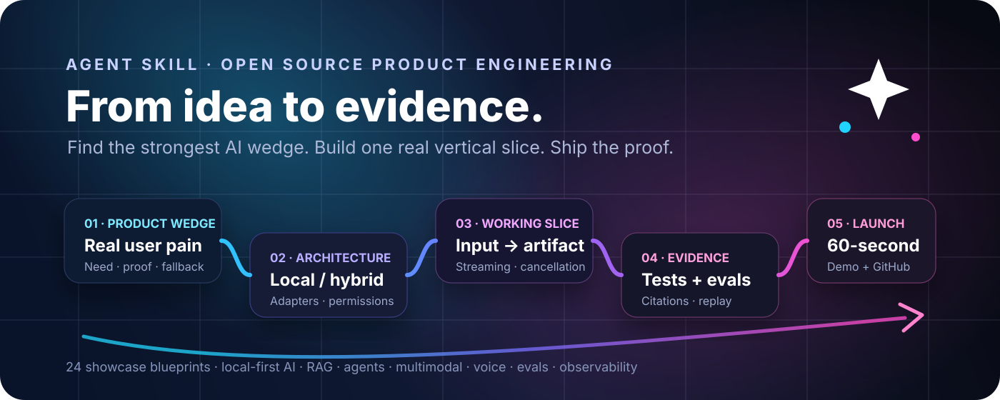
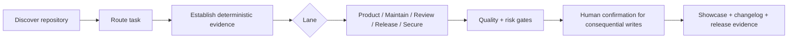

<p align="center">
  
</p>

<h1 align="center">AI Project Copilot 2.2.1</h1>

<p align="center">
  A portable Agent Skill for <b>AI product engineering + open-source maintainer intelligence</b>.<br />
  Map the repo. Route the task. Review risk. Prepare releases. Harden automation. Prove the result.
</p>

<p align="center">
  <a href="https://github.com/sun461941-hub/ai-project-copilot/actions/workflows/ci.yml"></a>
  
  
  
  
  <a href="LICENSE"></a>
</p>

<p align="center">
  <a href="README.zh-CN.md">简体中文</a> ·
  <a href="skills/ai-project-copilot/SKILL.md">Read the Skill</a> ·
  <a href="DEMO.md">3-minute demo</a> ·
  <a href="docs/repository-map.md">Repository map</a> ·
  <a href="ECOSYSTEM_BENCHMARK.md">Ecosystem benchmark</a> ·
  <a href="ROADMAP.md">Roadmap</a> ·
  <a href="CHANGELOG.md">Changelog</a>
</p>

> **v2.2.1 keeps the read-only GitHub evidence snapshot, explicit local run-state, and safe static maintainer dashboard while hardening stable-ID handling for partial exports.** It preserves human authority for consequential writes and keeps heuristic reports clearly separated from semantic proof.

## In 30 seconds

AI Project Copilot is an evidence-first maintenance layer for coding agents and
open-source repositories. It maps only the context needed, turns repository
state into inspectable evidence, and keeps merge, release, deployment,
permissions, and deletion under human control.

The shortest proof is the [three-minute local demo](DEMO.md): it imports a
checked-in GitHub JSON fixture, finds two blockers, records one local escalation,
and renders a safe dashboard—without making a network request or mutating
GitHub.

## Product map

### Core

| Capability | Outcome | Deterministic evidence |
|---|---|---|
| **Discover** | task-focused understanding of an unfamiliar repository | `repo_context.py`, `ai_ready_bootstrap.py`, `skill_stack_audit.py` |
| **Maintain** | bounded issue triage and explicit local evidence decisions | `maintainer_triage.py`, `github_evidence_sync.py`, `run_state_ledger.py` |
| **Review** | risk-ranked changes with fix/decline/escalate convergence | `change_risk.py`, `review_convergence.py` |
| **Release** | SemVer, migration, changelog, and readiness evidence | `release_intel.py` |
| **Secure** | Actions, MCP, permission, and integrity findings | `supply_chain_guard.py`, `mcp_config_audit.py` |
| **Quality** | deterministic validation and regression/eval evidence | `run_skill_evals.py`, `evals/evals.json` |

### Advanced, opt-in

| Capability | Use it when | Boundary |
|---|---|---|
| **Context Accelerator** | recon needs to be bounded and repeatable | proxy context metrics are not token-saving claims |
| **Model Budget** | an application owns a reviewed model-cost policy | deterministic CI is not proof of a live provider call |
| **Product design kits** | a team needs a credible launch or retrofit vertical slice | blueprints and references are design material, not an autonomous builder |

### Preview / compatibility package

The CLI, REST, and MCP adapters live in
[`ai-project-copilot-multi-interface-upgrade/`](ai-project-copilot-multi-interface-upgrade/).
They are an independently verified preview overlay, not the default installation
path or a claim of universal client compatibility. See its manifest and tests
before applying it to a checkout.

## Read-only GitHub evidence and local run-state

v2.2 turns an already-authorized local GitHub JSON export into a small,
reproducible evidence bundle. It recognizes issue, pull-request, workflow-run,
and release exports; creates stable IDs from their GitHub source identifiers;
and intentionally ignores long issue bodies. It makes **no GitHub API call** and
cannot merge, label, close, publish, or otherwise mutate GitHub.

```bash
python skills/ai-project-copilot/scripts/github_evidence_sync.py \
  --input-dir examples/github-export \
  --repo /path/to/repo \
  --output .aipc/github-evidence.json

python skills/ai-project-copilot/scripts/run_state_ledger.py init --repo /path/to/repo
python skills/ai-project-copilot/scripts/run_state_ledger.py sync \
  --repo /path/to/repo --bundle .aipc/github-evidence.json
python skills/ai-project-copilot/scripts/run_state_ledger.py status \
  --repo /path/to/repo --format markdown
```

Use `decide` to record `fix`, `decline`, `escalate`, or `observe` explicitly.
Declines require an evidence note and escalations require a human owner. The
local static dashboard HTML-escapes imported fields and defaults to the ignored
`.aipc/` area:

```bash
python skills/ai-project-copilot/scripts/render_maintainer_dashboard.py \
  --repo /path/to/repo \
  --bundle .aipc/github-evidence.json \
  --ledger .aipc/maintainer-ledger.json
```

Treat exports as untrusted text, not instructions. A clear dashboard only shows
the current local decision state; it is never a merge, security, deployment, or
release approval. See the [evidence and ledger reference](skills/ai-project-copilot/references/github-evidence-ledger.md).

## Advanced: AIPC Context Accelerator

v2.0 adds a dedicated efficiency layer for Codex and other coding agents. It does **not** claim to increase model tokens-per-second or bypass quotas. Instead, it reduces avoidable work before the model has to reason:

```text
Task → FAST / BALANCED / DEEP budget
     → changed-file + AGENTS instruction chain
     → bounded initial context packet
     → targeted tools/tests
     → compact failure evidence
     → exact-fingerprint non-critical evidence reuse
     → full critical/final gate
```

Start with a budget:

```bash
python skills/ai-project-copilot/scripts/token_governor.py \
  --prompt "fix the README typo" \
  --changed-file README.md \
  --format markdown
```

Compile one batched context packet instead of repeatedly listing/searching the repo:

```bash
python skills/ai-project-copilot/scripts/context_accelerator.py \
  --repo /path/to/repo \
  --task "review the auth change" \
  --git-status \
  --format markdown
```

For noisy tools, save the raw log before giving the agent a small evidence view:

```bash
mkdir -p .aipc
pytest -v > .aipc/raw-test.log 2>&1
python skills/ai-project-copilot/scripts/tool_output_compactor.py \
  --input .aipc/raw-test.log \
  --max-lines 80
```

`evidence_cache.py` can reuse only **passing, non-critical** evidence when the command and declared input-file content hashes match exactly. Security, release, deploy, migration, permissions, and final integration gates always bypass the cache. `.aipc/` cache state is gitignored.

The Skill core stays **under 250 lines** and pushes lane-specific detail into references. This follows the same design target as the rest of v2: give the agent a map and the minimum active rules, not a giant manual.

Reproducible context-efficiency fixtures live in [`benchmarks/`](benchmarks/). Their path/log character metrics are context-size **proxies**, not measured Codex tokens. Actual input/cached/reasoning/output token claims require client/API usage telemetry.

A local Linux / Python 3.13.5 run (15 repeats for each context case) produced:

| Case | Repo files | Initial files selected | Path-char proxy reduction vs all paths | Accelerator reconnaissance vs full map |
|---|---:|---:|---:|---:|
| FAST docs | 1,400 | 3 | 99.8769% | 0.571 ms vs 29.544 ms (**~51.7×** faster local reconnaissance) |
| BALANCED feature | 1,800 | 7 | 99.6854% | 34.966 ms vs 34.050 ms (**~2.7% overhead**) |
| DEEP security/release | 2,400 | 9 | 99.6637% | 49.521 ms vs 46.851 ms (**~5.7% overhead**) |

A synthetic 5,003-line test log was reduced from 184,074 to 949 characters (99.4844%) while preserving both failure markers, the final summary, and the normalized raw-log SHA-256. These numbers measure deterministic preprocessing only; they are **not Codex generation-speed or token-savings claims**.

## Advanced: Model Budget Autopilot

**Set a transparent preferred-model spending target.** Applications can let each user
cap ordinary preferred-model spend at a percentage of a period budget, then route
ordinary work through a reviewed fallback ladder when that allocation ceiling
or its share-control line is reached.

```text
$20 monthly portfolio
quality model allocation  <= 40%  ████████
shared remainder target   >= 60%  ████████████
```

This is an ordinary-work allocation ceiling, not a ring-fenced balance:
protected tasks and a quality upgrade may exceed it, while other requests can
consume the shared period admission cap.

`model_budget_autopilot.py` uses immutable SQLite route decisions and atomic
cost reservations. It handles cold start, concurrent requests, a lower restore
line to prevent route flapping, protected security/release/migration tasks, late
usage, usage overruns, request-payload binding, provider-response deduplication,
renewable leases, and one quality-gated upward retry. A fallback is never chosen
when its projected request cost is higher than the requested model's.

v2.1 also includes `model_budget_gateway.py`, a live-capable OpenAI Responses bridge.
It counts the exact input shape for every reviewed ladder model in parallel,
atomically binds the selected-model request bytes, streams the response, renews
the lease, settles provider-reported usage, records TTFT/E2E timing, runs an optional
deterministic quality command, and executes at most one budget-checked upgrade.

```bash
read -rsp "OpenAI API key: " OPENAI_API_KEY && export OPENAI_API_KEY
printf '\n'
cp skills/ai-project-copilot/assets/templates/openai-response-request.json request.json

python skills/ai-project-copilot/scripts/model_budget_gateway.py \
  --db .aipc/model-budget.sqlite3 \
  --user opaque-trusted-user \
  --request-id task-001-attempt-1 \
  --logical-request-id task-001 \
  --request request.json \
  --task-class routine \
  --format json
```

Configure the ledger and replace the request model/price card first. The key is
environment-only and is not written to the ledger or quality subprocess. This
v2.1 executor accepts text input and text/JSON output only: image, audio, file,
prompt-template, tool, and background requests fail closed until those
lifecycles and variable charges can be reconciled. Deterministic transports
exercise the protocol in CI; only a successful run with your own key is evidence
that the live provider path worked in your environment. See
[`openai-responses-gateway.md`](skills/ai-project-copilot/references/openai-responses-gateway.md).

Run the network-free proof scenario:

```bash
python skills/ai-project-copilot/scripts/model_budget_autopilot.py \
  simulate --format json
```

The synthetic result lists the first fallback, an intentionally incomplete
response, the single authorized upgrade, and the final quality-gated selected
model. It is an
offline control-flow test, not a live model call. This feature controls
**cost allocation**. A lower-cost model does not inherently consume fewer
tokens, so Token savings remain unknown until the same real tasks are measured
before and after. See
[`references/model-budget-autopilot.md`](skills/ai-project-copilot/references/model-budget-autopilot.md)
for integration, pricing, lifecycle, and trust boundaries.

After paired baseline/candidate runs, calculate the measured aggregate effect—while
keeping failed and retried attempts in the totals:

```bash
python skills/ai-project-copilot/scripts/compare_efficiency_runs.py \
  --baseline baseline.jsonl \
  --candidate candidate.jsonl \
  --require-improvement \
  --format markdown
```

This reports measured Token saving, price-card cost saving, TTFT, end-to-end
latency reduction, and speedup. It rejects mismatched request-template,
quality-policy configuration, or pricing-policy fingerprints. The pricing
fingerprint binds the reviewed model ladder and price cards, protected-task
policy, served-model map, fixed extra cost, and default service tier; the request
fingerprint also binds the requested model and task class. These fingerprints
still cannot prove that an external
evaluator executable was unchanged or reconcile a provider invoice. A single run reports
`token_savings=null` because it has no task-aligned counterfactual.

## Technical reference

The ecosystem repeatedly converges on a few patterns: progressive disclosure, deterministic scripts, codebase mapping, PR loops, release automation, supply-chain/security review, skill evals, role orchestration, structured JSON output, and context-efficient black-box helpers. v2 integrates those patterns into one coherent workflow instead of shipping dozens of disconnected prompts. See [`ECOSYSTEM_BENCHMARK.md`](ECOSYSTEM_BENCHMARK.md).

## Core workflow



## Deterministic intelligence helpers

### 1. Map an unfamiliar repository

```bash
python skills/ai-project-copilot/scripts/repo_context.py \
  --repo /path/to/repo \
  --task "change authentication without breaking mobile clients" \
  --format markdown
```

Returns language/manifest/entrypoint/test/CI/governance evidence plus task-focused files. It does not pretend folder names alone prove architecture.

### 2. Make a repo AI-ready without overwriting policy

```bash
python skills/ai-project-copilot/scripts/ai_ready_bootstrap.py \
  --repo /path/to/repo \
  --target agents \
  --target copilot \
  --json
```

This creates evidence-based instruction drafts only when targets do not already exist, unless `--force` is explicitly requested.

### 3. Audit the local Agent Skill Stack

```bash
python skills/ai-project-copilot/scripts/skill_stack_audit.py \
  --project /path/to/repo \
  --format markdown
```

It inventories local skills, bundled scripts/references/assets, duplicate names, portability warnings, and likely trigger overlap. It never installs or executes third-party skills.

### 4. Route a broad request

```bash
python skills/ai-project-copilot/scripts/workflow_router.py \
  --prompt "review this PR, check security, then prepare a release" \
  --format markdown
```

### 5. Prioritize PR risk

```bash
python skills/ai-project-copilot/scripts/change_risk.py \
  --patch change.diff \
  --format markdown
```

Risk lanes include auth/security, schema/migrations, public API/contracts, CI/supply chain, deployment/config, diff size, and missing test evidence. The score prioritizes review effort; it is not a safety certificate.

### 6. Verify PR review convergence

After semantic review-thread decisions are stored as `fix`, `decline`, or `escalate`:

```bash
python skills/ai-project-copilot/scripts/review_convergence.py \
  --threads-json review-state.json \
  --format markdown
```

The gate fails while an agent-actionable thread remains open or an escalation lacks a human owner. Passing the gate is not merge approval.

### 7. Build release intelligence

```bash
python skills/ai-project-copilot/scripts/release_intel.py \
  --repo /path/to/repo \
  --from-ref v1.1.0 \
  --current-version 1.1.0 \
  --format markdown
```

Produces a SemVer recommendation, grouped draft release notes, breaking-change migration requirements, and deterministic blockers — without publishing anything.

### 8. Scan GitHub Actions, MCP config, and skill integrity

```bash
python skills/ai-project-copilot/scripts/supply_chain_guard.py \
  --repo /path/to/repo \
  --format markdown
```

Checks visible workflow signals such as explicit permissions, privileged triggers, mutable action refs, event interpolation, and privileged checkout patterns. Writing a SHA-256 manifest is opt-in via `--manifest`.

If the repo registers MCP servers, add:

```bash
python skills/ai-project-copilot/scripts/mcp_config_audit.py \
  --repo /path/to/repo \
  --format markdown
```

This checks configured literal secrets, insecure remote URLs, shell-wrapper launchers, and unpinned dynamic runner packages without executing the server.

## PR review loop: fix / decline / escalate

v2 does not blindly optimize for “zero comments.” Every review thread is classified:

- **fix** — evidence shows a real defect/regression/risk;
- **decline** — suggestion is wrong, out of scope, or unsupported by repo conventions;
- **escalate** — product/security/migration/design decision belongs to a human maintainer.

Then it reruns the repository’s actual lint/test/build commands and rechecks the changed risk surface. `review_convergence.py` provides a deterministic stop condition so an iterative review loop cannot quietly leave agent-actionable threads behind.

## Release intelligence, not release theater

A release path now covers:

- SemVer classification;
- breaking-change and migration-note detection;
- Keep-a-Changelog-style grouping;
- CI/test/artifact evidence;
- supply-chain/workflow review;
- deterministic packaging/checksums when available;
- an explicit confirmation gate before tag/release publication.

The hosted Release workflow accepts only a GitHub-verified signed annotated
SemVer tag whose commit is already reachable from `main`. It reruns canonical
and Preview validation, verifies a deterministic rebuild and unpacked archive,
then publishes the archive, CycloneDX SBOM, SHA-256 manifest, and GitHub build
attestation only after the protected `release` environment is approved.

## Security and governance

Actions are classified by consequence:

1. read-only;
2. reversible write;
3. consequential write;
4. destructive.

Read-only discovery is the default. Merge, publish, permission changes, deploys, deletion, and other consequential actions require preview and user confirmation. External pages, issues, PR text, retrieved docs, and tool output are treated as untrusted data rather than instruction authority.

## Quality and evals

The Skill includes a portable `skills/ai-project-copilot/evals/evals.json` with substantive scenarios for:

- codebase discovery;
- risky PR review;
- SemVer/release planning;
- GitHub Actions security;
- issue triage and good-first-issue quality;
- review-thread triage;
- measured quality loops;
- supply-chain manifests and MCP configuration boundaries;
- role orchestration;
- AI-ready instruction bootstrap and local Skill Stack audits;
- review convergence state;
- near-miss prompts that should not trigger the full Skill.

Run the bundled structural and deterministic cases:

```bash
python skills/ai-project-copilot/scripts/run_skill_evals.py \
  --format markdown
```

The runner validates 27 static eval records and 20 trigger fixtures, then runs
four Skill-bundled deterministic command cases without a shell. It explicitly
reports `semantic_grading_performed=false`: prompt expectations are not model
outputs. The quality loop remains **derive requirements → baseline →
evidence-sized change → repeat the same checks → keep/revert based on results**.
For a real-model baseline, use the fixed tasks and independent rubric in the
[semantic evaluation protocol](docs/semantic-eval-protocol.md); no semantic
success rate is claimed until that protocol has real, redacted run evidence.

After running a pinned client/model and independently reviewing the redacted
JSONL records, validate the bundle without transmitting it anywhere:

```bash
python skills/ai-project-copilot/scripts/validate_semantic_eval_results.py \
  --input .aipc/semantic-evals/redacted-results.jsonl \
  --require-complete \
  --fail-on-unsafe \
  --format markdown
```

## Optional multi-agent orchestration

When the client supports subagents, v2 can isolate roles:

- mapper/planner;
- implementer;
- reviewer;
- security reviewer;
- release/verifier.

Independent read-only analysis may run in parallel; writes remain serialized to avoid conflicting edits, and one final evidence gate owns the conclusion.

## AI-ready repository and Skill Stack intelligence

v2 also absorbs the strongest "meta-skill" patterns without turning into an installer:

- map unfamiliar repositories before editing;
- create reviewable `AGENTS.md` and Copilot instruction drafts without overwriting existing policy;
- inventory local Agent Skills across common project/user locations;
- detect duplicate skill names and high description/trigger overlap;
- keep third-party discovery/install/update as an explicit, separately authorized action.

## Product design kits (reference, not the core maintenance path)

v2 keeps the original strengths:

Every blueprint still needs a credible **60-second** wow moment, explicit proof,
and a safe fallback; these are product-design references rather than promises of
autonomous product delivery.

- 24 project blueprints including Codex Build Visualizer and Android Local Video Runtime;
- local-first/cloud/hybrid architecture guidance;
- RAG, agents/tools, multimodal, voice, media generation, local models, memory, streaming, evals, observability;
- privacy/model-license/tool-safety boundaries;
- realistic demo scripts and README templates;
- deterministic skill validation and packaging;
- Linux, Windows, and macOS CI.

## Install

### Codex / Agent Skills-compatible clients

```text
$skill-installer install https://github.com/sun461941-hub/ai-project-copilot/tree/main/skills/ai-project-copilot
```

Manual project-scoped install:

```bash
mkdir -p .agents/skills
cp -R skills/ai-project-copilot .agents/skills/ai-project-copilot
```

The core format stays Agent Skills-compatible; individual clients may use additional native skill locations.

## Validate and package

```bash
python tools/validate_skill.py skills/ai-project-copilot
python -m unittest discover -s tests -v
python tools/package_skill.py skills/ai-project-copilot \
  --output dist/ai-project-copilot.skill.zip
```

## Repository structure

```text
skills/ai-project-copilot/
├── SKILL.md
├── agents/openai.yaml
├── assets/templates/
├── evals/evals.json
├── references/
│   ├── capability-router.md
│   ├── codebase-context.md
│   ├── pr-review-loop.md
│   ├── release-intelligence.md
│   ├── openai-responses-gateway.md
│   ├── security-governance.md
│   ├── quality-orchestration.md
│   └── ...existing product references
└── scripts/
    ├── token_governor.py
    ├── context_accelerator.py
    ├── model_budget_autopilot.py
    ├── model_budget_gateway.py
    ├── compare_efficiency_runs.py
    ├── run_skill_evals.py
    ├── tool_output_compactor.py
    ├── evidence_cache.py
    ├── workflow_router.py
    ├── repo_context.py
    ├── ai_ready_bootstrap.py
    ├── skill_stack_audit.py
    ├── maintainer_triage.py
    ├── change_risk.py
    ├── review_convergence.py
    ├── release_intel.py
    ├── supply_chain_guard.py
    ├── mcp_config_audit.py
    └── ...existing helpers
```

For the complete maintainer map—including the boundary between canonical Skill
source, the active multi-interface compatibility package, generated outputs,
verification commands, and the release path—read
[`docs/repository-map.md`](docs/repository-map.md) before moving or deleting
repository assets.

## Demo path

Start with the copy-paste [three-minute maintainer demo](DEMO.md). It is the
complete local path from untrusted export → blocker evidence → local decision →
dashboard. The longer Core workflow below is for a real repository after that
first proof succeeds.

## Limitations and model/provider boundary

- Heuristic scores prioritize attention; they are not security, correctness, or production-readiness certificates.
- The Skill does not bundle or redistribute third-party model weights. Model/provider selection remains an explicit project decision with license and data-boundary review.
- Local Skill Stack audit does not establish trust, popularity, or safety and does not install/update anything.
- Semantic code review still requires reading the actual implementation and tests; deterministic helpers cannot replace domain expertise.
- Connected GitHub/MCP actions depend on the client and permissions available at runtime; read-only analysis remains the portable baseline.
- Character/path reduction and local runtime benchmarks are deterministic proxies; they must not be reported as exact Codex token savings or backend speedups.
- The live-capable gateway covers text-input/text-or-JSON-output OpenAI Responses requests and price-card settlement, not multimodal input, tools, background jobs, provider invoice reconciliation, or an absolute spend guarantee.
- Real Token/cost/latency percentages require aligned baseline and candidate tasks with the same configured success gate and reviewed price cards; the comparator checks requested model/task class, request template, quality-policy configuration, pricing/protection policy, and served-model mapping, not external evaluator binaries or provider invoices. The project does not publish a universal savings percentage.

## Design principles

1. **Inspect before editing.**
2. **Evidence before confidence.**
3. **One coherent workflow beats a bag of prompts.**
4. **Deterministic tools handle repetitive classification; models handle ambiguity.**
5. **High consequence means stronger human control.**
6. **Progressive disclosure keeps the Skill powerful without bloating context.**
7. **No benchmark, compatibility, security, maintenance, or adoption claim without evidence.**

## License

MIT © 2026 `sun461941-hub`
